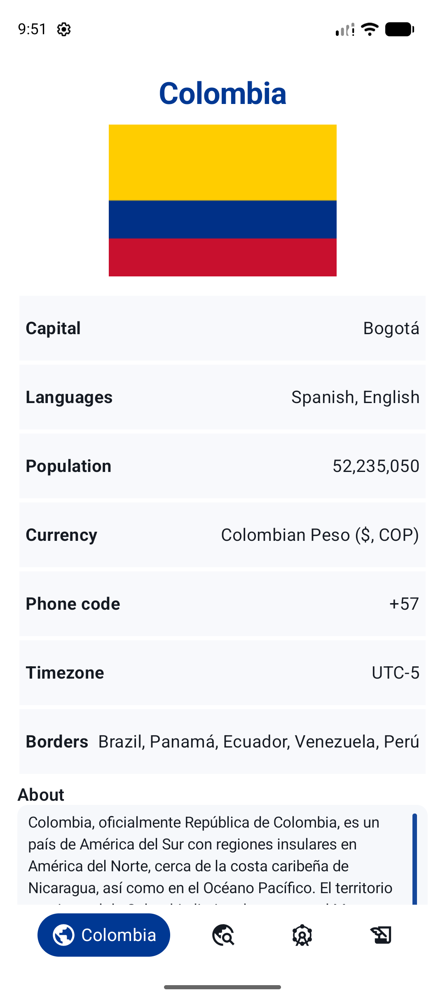
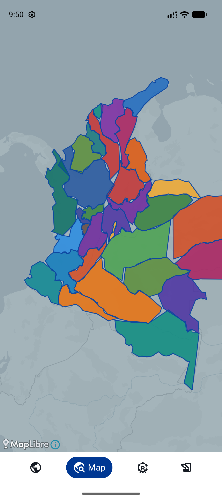
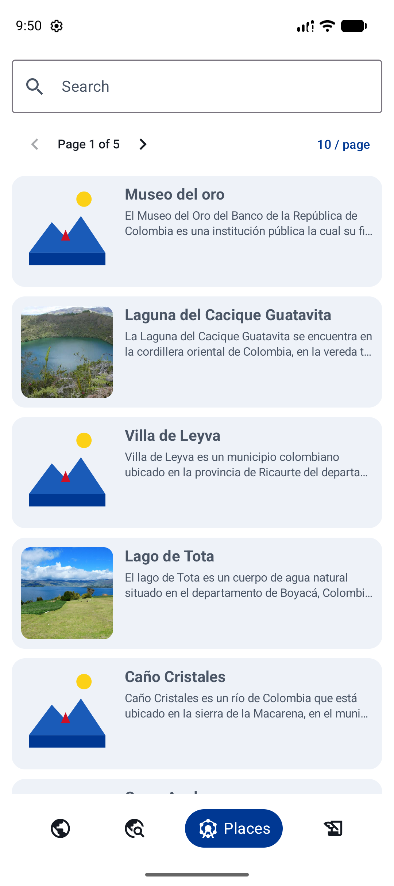
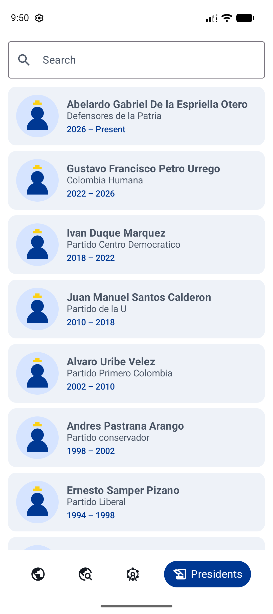

# Colombia App

An educational Android app for exploring Colombia — country facts, an interactive department map, touristic places, and a searchable history of presidents. Built with modern Android tooling and open data.

Data comes from **[API Colombia](https://api-colombia.com)**, a free public API about Colombia. The interactive map is powered by **[MapLibre](https://maplibre.org/)**, an open-source mapping stack (no Google Maps key required).

<p align="center">
  
  
  
  
</p>

## What you can explore

- **Colombia** — capital, population, languages, borders, and a long-form country description  
- **Map** — department polygons on a MapLibre basemap; tap a region to browse its attractions  
- **Places** — paginated touristic attractions with search, images, and detail screens  
- **Presidents** — searchable list of presidents with terms, parties, and biographies  

The UI uses a Colombia-inspired palette, Compose Material 3, and clear navigation so the content stays easy to read on phone screens.

## Architecture

```
:app                    Application shell, navigation, theme
:core:common            Shared UI widgets + BaseViewState
:core:domain            Models + repository contracts
:core:data              Retrofit, remote sources, repository impls (Hilt)
:feature:country        Country overview
:feature:map            MapLibre department map + attractions sheet
:feature:attractions    Attractions list/detail
:feature:presidents     Presidents list/detail
```

**Stack:** Kotlin · Jetpack Compose (Material 3) · Hilt + KSP · Retrofit · Coil · MapLibre  

This project is a compact example of multi-module Clean Architecture on Android: feature modules own their screens, `:core:domain` stays free of Android UI, and `:core:data` wires the API and repositories.

## Credits & data

| Source | Role |
|--------|------|
| [API Colombia](https://api-colombia.com) | Country, presidents, departments, and touristic attractions |
| [MapLibre](https://maplibre.org/) | Vector map rendering and interaction |
| OpenFreeMap (Positron) | Light basemap style used under MapLibre |
| DANE MGN (simplified GeoJSON) | Department boundaries bundled in `:feature:map` assets |

## Build

```bash
./gradlew :app:assembleDebug
```

Requirements: JDK 17+, Android SDK 35+.

## License

See the repository for license details. Third-party APIs and map styles remain subject to their own terms.
